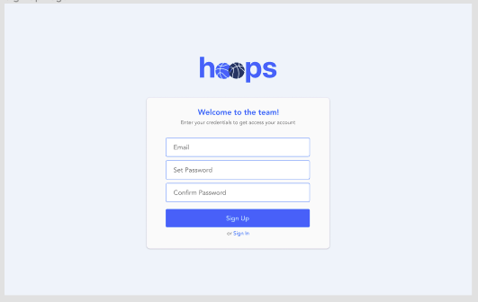
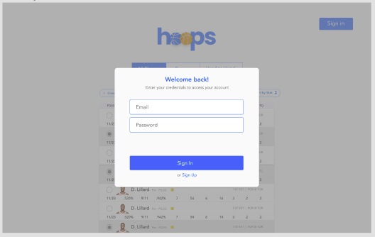
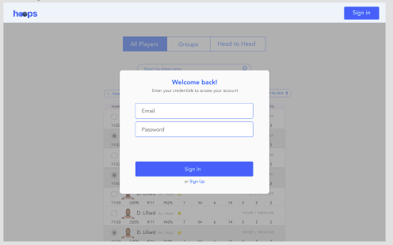

# Sign in and Sign up flow 

We considered 3 flows in the sign in and sign up process. 

1. Having a separate page for sign in and sign up\

- Login page would have its own route and would be technically feasible. 
- Seems more natural in terms of user flow

2. Having a sign in modal\

- Incorporating modals would be more technically challenging given the time constraint. 

3. Having a sign in header\

- Having a header with sign in button and modal could create confusion to users. 

We finally decided on the first version for sign in and sign up page as it looked cleaner and would be more feasible to link. 